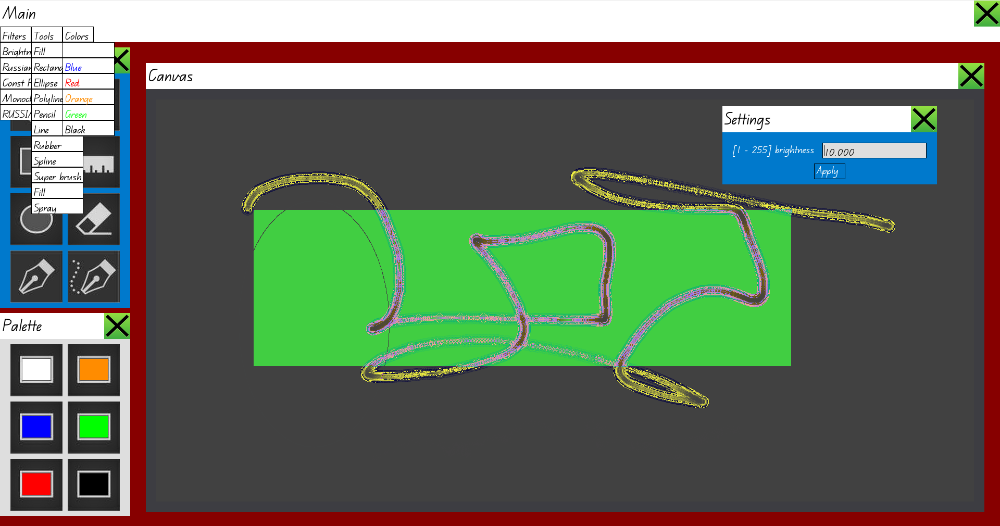

# Graphic editor
Это графический редактор с GUI на базе SFML и поддерживаемыми плагинами.

Стандарт плагинов находится [здесь](include/plugin/standart/). Чтобы подключить свой плагин, нужно добавить соответствующий .so файл в директорию `plugin_examples/so/`.



Рендеринг осуществляется с помощью техники **регионов отсечения**: каждый виджет хранит список своих прямоугольных областей (регионов), которые видны на экране в текущем фрейме. При обновлении состояния системы виджетов, их регионы при необходимости пересчитываются, и для следующего фрейма рендерятся только изменившиеся регионы.


## Сборка и запуск
Чтобы собрать проект, используйте команду:
```
make all
```
Для запуска используйте:
```
./build/editor
```
